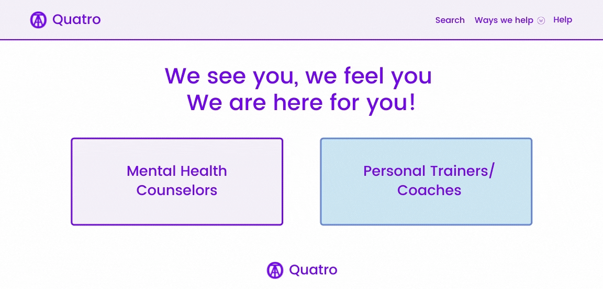

# Quatro Wellness

## About the app: Marketplace of mental health counselors and personal trainers based on conditional questionnaire provided upon entering the webpage. Results of coaches will be displayed based on the user score assigned based on answers. 

## Audience: Parents who are in mental, physical and financial crisis during COVID-19.

   ### 1. Users: Parents who are stuck at home, homeschooling kids with declining patience while dealing with children academically and lack of time for self care. 
   ### 2. Providers: Parents: Mental Health counselors and Personal Trainers who are stuck at home, homeschooling - decline in business due to childcare. 

## Purpose: Because there are many parents stuck at home who are going through mental, physical and financial burden. Two of the founders of this project are actively experiencing these obstacles real time. So, the other two decided to save them. 

## Check out our awesome project here. Stay healthy! 

https://sitoraalexander.github.io/quatro/

